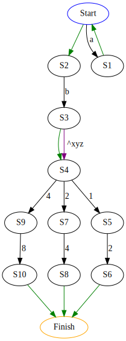

# Toy Regular Expression parser

Workflow:
- gets a pattern input, for example `cargo run -- "a*b[^xyz]?(12|24|48)"`
- parses the pattern into an AST of AND / OR / token
- transforms the AST into a state graph (eg for `a*b[^xyz]?(12|24|48)`):

